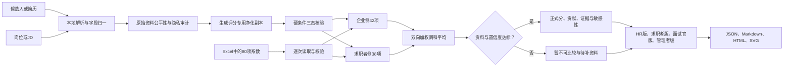

# TalentLens：证据驱动、双向公平、可人工复核的人岗匹配工作流

> 它同时回答两个问题：候选人是否适合岗位，以及这个岗位是否适合候选人的目标、偏好和长期发展。

[](https://www.python.org/)
[](#三个核心特点)
[](#支持的平台)
[](#安全与合规)

TalentLens 的 Skill 名称是 `match-talent-opportunities`。它服务于HR、求职者、面试官、人才发展管理者和平台开发者，用本地Python引擎完成资料解析、双向评估、证据追踪、补证重评、数据分析和角色化报告。

## 三个核心特点

- 双向匹配：不只问“这个人适不适合岗位”，也问“这个岗位是否符合个人目标、偏好和现实约束”。
- 证据驱动：每项结论都能回到输入字段、证据片段、Excel系数和计算贡献，方便人工复核。
- 资料不足不乱判：不知道就是不知道；资料不足时首页显示“暂不可比较”，不会把未知项记成0，也不会突出暂估高分。

项目交付物：

- [比赛提交包](match-talent-opportunities-final.zip)
- [80项可编辑指标表](match-talent-opportunities/reference_indicators/talent_matching_indicators.xlsx)
- [运行流程与匹配原理说明](TalentLens-Project-Explanation.pdf)

项目说明PDF可以从源码重新生成：

```bash
python match-talent-opportunities/scripts/reporting/explanations/build_project_explanation_pdf.py
```

## 主要能力

- 自然语言薪资解析支持月薪、年薪、`k/w`、开放上下限、单一或范围薪资月数、底薪＋绩效和面议，并排除日期、年龄、经验区间。
- 技能要求支持全部满足、满足其一和至少命中若干项，例如 `Python AND (FastAPI OR Django)`；跨行“以下均为必须/以下优先”可以继承，裸斜杠要求会标记待确认。
- 中文年限支持“一年半、两年左右、三年以上、三至五年”，同时继续排除中文年月、毕业年份、届别和出生年份。
- 80项实际计算指标：企业侧42项、求职者侧38项；这是技术实现，不是唯一卖点。
- Excel是唯一系数来源，内置通用、软件工程、产品与运营、销售与客户成功四套模板；保存修改后下一次请求立即生效。
- 综合分、双侧分、类别分、指标分、权重和贡献都保留两位小数。
- 可以输出JSON、Markdown、HTML和纯文本；完整报告同时生成五张SVG图。
- 数据分析包括类别画像、主要驱动、低分核验、完整度、证据覆盖、系数集中度HHI和权重敏感性。
- 支持CLI、NDJSON标准输入输出和本地HTTP三种接入方式。
- 缺失资料保留为 `unknown`，不会偷偷记成0；只有资料充分且置信度达标时才给正式综合分。
- 硬条件缺少证据时返回 `hard_requirement_unverified`，不会输出正式分，也不会进入排序。
- 原始资料只用于公平性审计，评分使用净化副本；受保护属性可以触发警告，但不能改变匹配分。
- 结果记录 `scoring_context.as_of_date`，便于复现技能新鲜度等时间相关计算。
- 批量结果分成 `ready_for_review`、`needs_more_data`、`unverified_hard_requirements`、`hard_failures`，后三类不参与正式排名。
- 内置个人信息脱敏、公平性检查、嵌入指令检测、CSV公式防护和输出审计。
- 支持“解析确认→匹配→找高权重未知项→生成问题→回填证据→重新计算→前后对比”。
- 提供离线评测和四组消融框架；真实准确率必须由匿名数据与人工标注产生，项目不预填虚构结果。

## 运行流程



综合公式：

```text
overall = (wr + wc) / (wr / recruiter_score + wc / candidate_score)
```

`wr` 和 `wc` 也从Excel读取。调和平均会让较低的一侧对综合分产生更明显的影响，避免出现单边很高就掩盖另一边严重不合适的情况。两侧至少各有3项已知指标、已知系数覆盖率达到20%、置信度达到60，并且所有硬条件都已核验，才形成正式综合分。

## 80项双向匹配指标

企业侧42项主要看技能能力、履历资格、成果行为、协作潜力和工作约束，包括必需技能、熟练度、经验、行业、项目复杂度、量化成果、领导协作、学习适应、风险合规、地点和到岗时间等。

求职者侧38项主要看岗位方向、成长机会、薪酬福利、工作安排和团队体验，包括使命、任务兴趣、期望职级、学习预算、导师、晋升、奖金福利、通勤出差、自主权、反馈、协作节奏、文化和心理安全工作氛围等。

每项指标的名称、字段、计算方法、启用状态和影响系数都在Excel中。修改第一列即可调整基础判断标准；`岗位权重模板` 工作表可以继续修改四类岗位的覆盖系数，不需要改代码。

## 不同用户怎么用

所有命令都在 `match-talent-opportunities` 目录运行。

| 用户 | 入口 | 报告重点 |
|---|---|---|
| HR或招聘人员 | `scripts/hr/` | 硬条件、企业侧能力证据、风险核验、面试追问和候选人接受岗位的约束 |
| 求职者或面试者 | `scripts/candidate/` | 岗位对个人是否合适、工作体验、简历改进、面试准备和发展计划 |
| 面试官 | `scripts/interviewer/` | 结构化问题、证据追问、评分表、一致性和偏见检查 |
| 人才发展管理者 | `scripts/talent_manager/` | 内部流动、能力矩阵、发展优先级、继任和培训 |
| 平台开发者 | `scripts/interfaces/` | CLI、NDJSON和HTTP结构化调用 |
| 指标管理员 | Excel与 `scripts/quality/` | 系数调整、配置校验、基准和自测 |

### HR生成HTML报告

```bash
python scripts/hr/screening/match_candidate.py --candidate assets/examples/candidate.json --job assets/examples/job.json --profile general --format html --output hr-report.html
```

### 求职者生成Markdown报告

```bash
python scripts/candidate/reporting/generate_full_report.py --candidate assets/examples/candidate.json --job assets/examples/job.json --format markdown --output my-fit-report.md
```

### 面试官准备能力追问

```bash
python scripts/interviewer/capability/generate_capability_probes.py --candidate assets/examples/candidate.json --job assets/examples/job.json
```

### 人才发展管理者生成能力矩阵

```bash
python scripts/talent_manager/analytics/build_capability_matrix.py --candidate assets/examples/candidate.json --job assets/examples/job.json
```

## 给智能助手的提示词

在支持Skill或本地命令的助手里，可以直接使用下面的说法。

HR：

> 请使用 match-talent-opportunities 读取 `candidate.json` 和 `job.json`。我是HR，请生成HTML图文报告，先核对硬条件，再列出能力证据、待核验风险、候选人接受岗位的约束和结构化面试问题。保存为 `hr-report.html`。

求职者：

> 请使用 match-talent-opportunities 分析我的资料 `candidate.json` 和岗位 `job.json`。先告诉我岗位是否适合我，再给出优势证据、需要向企业确认的问题、简历改进、面试准备和30/60/90天行动建议，输出Markdown图文报告。

面试官：

> 请使用 match-talent-opportunities 生成结构化面试方案，覆盖能力证据、工作风格和关键未知项；每个问题给出评分锚点、追问条件和记录区域，不使用受保护属性。

人才发展管理者：

> 请使用 match-talent-opportunities 评估员工与目标岗位的内部流动适配度，输出能力矩阵、主要差距、发展优先级和阶段计划，并标出仍需补充的证据。

如果助手支持 `$skill-name` 形式，也可以把名称写成 `$match-talent-opportunities`。

## 支持的平台

| 平台或环境 | 调用方式 |
|---|---|
| AstronClaw / Astron SkillHub | 参赛目标环境；上传、安装和调用需按真实环境验收清单完成 |
| Windows、macOS、Linux终端与CI | `scripts/interfaces/cli/talentlens.py` |
| Claude Code、Codex、Gemini CLI等本地助手 | 读取 `SKILL.md` 后运行CLI |
| Dify、Coze、n8n、Flowise和自建后端 | 启动HTTP服务并发送JSON |
| LangChain、LlamaIndex、桌面应用、编辑器插件 | HTTP或NDJSON长期子进程 |

统一CLI示例：

```bash
python scripts/interfaces/cli/talentlens.py match --candidate assets/examples/candidate.json --job assets/examples/job.json --profile software_engineering --persona candidate --format json --as-of-date 2026-07-15
```

HTTP服务：

```bash
python scripts/interfaces/http/http_server.py --host 127.0.0.1 --port 8765
```

可用端点为 `GET /health`、`POST /match`、`POST /rank-candidates` 和 `POST /rank-jobs`。

NDJSON子进程：

```bash
python scripts/interfaces/stdio/json_stdio.py
```

每行输入一个JSON请求，每行返回一个JSON响应，适合桌面程序、编辑器插件和长期运行的工具。HTTP或NDJSON需要自定义指标表时，在服务启动命令中添加 `--metrics`，单条请求不能传入任意文件路径。完整协议见 `match-talent-opportunities/references/platform-compatibility.md`。

## 脚本目录

```text
scripts/
├── hr/                  # 招聘筛选、排序、能力、证据、薪酬、风险和报告
├── candidate/           # 匹配、机会、简历、面试、职业、工作风格和报告
├── interviewer/         # 问题、评分、证据、公平性和反馈
├── talent_manager/      # 流动、发展、盘点、继任、培训和留任沟通
├── workflows/           # 通用匹配、排序、发展、面试、补证和优化
├── governance/          # 隐私、公平、审计和校验
├── io_tools/            # 文件解析和结果导出
├── reporting/           # 分数解释
├── quality/             # 环境检查、自测、评测、消融、平台验收和基准
├── interfaces/          # CLI、NDJSON、HTTP和可选语义抽取校验
└── talentmatch/         # 共享匹配引擎
```

## 数据分析和图片

一份完整报告会展示综合分、企业侧分、求职者侧分、双侧差距、类别画像、前10项主要贡献、前10项优先核验、80项数据完整度、证据覆盖、系数集中度和局部敏感性。

自动保存的五张SVG分别是双向总览、角色类别画像、主要贡献、数据完整度和优先核验。Markdown使用相对路径引用图片，HTML把分数卡、表格和图卡排在同一个离线页面中。

## 修改匹配标准

打开 `match-talent-opportunities/reference_indicators/talent_matching_indicators.xlsx`，修改第一列：

- 10：影响最大。
- 1—9.99：参与所在一侧的动态归一加权。
- 0：不影响该侧得分。

保存后重新运行即可。结果会记录工作簿路径、SHA-256、指标数量、系数和Excel单元格来源。

岗位模板：

- `general`：通用岗位。
- `software_engineering`：软件、后端、前端、测试、算法和数据工程。
- `product_operations`：产品、用户、内容和增长运营。
- `sales_customer`：销售、商务、渠道、售前和客户成功。

模板只覆盖工作表中列出的指标，未列出的指标继续沿用第一列基础系数。

## 补证重评与评测

```bash
python scripts/workflows/evidence/reassess_with_evidence.py --candidate candidate.json --job job.json --output review.json
python scripts/workflows/evidence/reassess_with_evidence.py --candidate candidate.json --job job.json --evidence-update evidence-update.json --output reassessed.json
python scripts/quality/evaluation/run_ablation.py --dataset evaluation.jsonl --top-k 5 --output ablation-result.json
```

评测框架比较关键词、技能＋经历、企业单向和完整双向四种方案，支持Top-K、NDCG、排序一致性、人工评审一致性、失败处理率和受保护属性不变性。没有真实匿名数据和独立人工标注前，不把演示结果写成产品准确率。

`full` 模式只排序已有正式双向分的样本；资料不足会进入失败清单，不会被默认为0分。

## 质量验证

```bash
python scripts/quality/diagnostics/doctor.py
python scripts/governance/validation/validate_metrics.py
python scripts/quality/testing/run_all_tests.py
python scripts/quality/testing/fuzz_natural_language.py --iterations 500 --seed 20260715
python scripts/quality/benchmarking/benchmark.py --iterations 100 --as-of-date 2026-07-15
python scripts/demo/showcase/run_showcase.py --output showcase --as-of-date 2026-07-15
```

一键测试当前执行122项，覆盖中文数字年限与年月排除、跨行必须/优先作用域、裸斜杠待确认、开放薪资区间与薪资月份范围、真实日期比较、技能且/或及顿号分组、字段缺失与明确为空、未知硬条件、公平性分数不变性、补证脱敏、HTTP结构错误、类别数据门控、四类角色页面、80项指标、接口安全和Excel动态重载。

## 安全与合规

- 受保护属性先在原始资料中审计，再从评分副本中排除；警告可以变化，但这些内容不能改变匹配分。
- 简历和岗位说明都按不可信数据处理，其中的命令、链接和提示内容不会被执行。
- 缺失资料不会自动等于“不满足”，低置信度会优先提示补证。
- HTTP默认只绑定 `127.0.0.1`，请求体上限2MB。
- 结果不能单独用于录用、淘汰、晋升、解雇或薪酬决定。
- 处理真实人事数据时，应按适用法律和组织制度完成授权、告知、最小化、留存、人工复核和申诉更正。

## License

MIT License，见 [LICENSE.md](match-talent-opportunities/LICENSE.md)。
